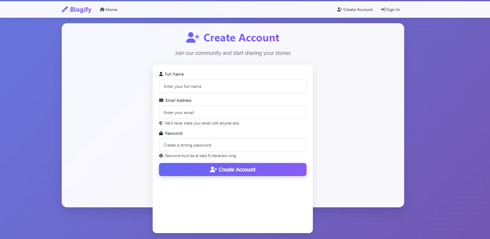

# YouTube Blog Application

A simple blog application built with Node.js, Express, MongoDB, and EJS.

## Features

- User authentication (signup/signin)
- Create and view blogs
- Add comments to blogs
- Image upload for blog covers
- Responsive design with Bootstrap

  ## Screenshots

### 🏠 Home Page


### ✍️ Add New Blog


### 👤 Signup Page


### 👤 SignIn Page


## Setup

1. **Install dependencies:**
   ```bash
   npm install
   ```

2. **Create a .env file** in the root directory with:
   ```
   MONGO_URL=mongodb://localhost:27017/blogify
   PORT=8000
   ```

3. **Start MongoDB** (make sure MongoDB is running on your system)

4. **Run the application:**
   ```bash
   npm start
   # or for development
   npm run dev
   ```

5. **Access the application** at `http://localhost:8000`

## Project Structure

- `models/` - MongoDB schemas
- `routes/` - Express routes
- `views/` - EJS templates
- `middlewares/` - Authentication middleware
- `services/` - Authentication services
- `public/` - Static files (CSS, JS, images)

## API Endpoints

- `GET /` - Home page with all blogs
- `GET /user/signup` - Signup page
- `POST /user/signup` - Create new user
- `GET /user/signin` - Signin page
- `POST /user/signin` - Authenticate user
- `GET /user/logout` - Logout user
- `GET /blog/add-new` - Add new blog page
- `POST /blog` - Create new blog
- `GET /blog/:id` - View specific blog
- `POST /blog/comment/:blogId` - Add comment to blog

## Technologies Used

- Node.js
- Express.js
- MongoDB with Mongoose
- EJS templating
- Bootstrap for UI
- Multer for file uploads
- JWT for authentication 
